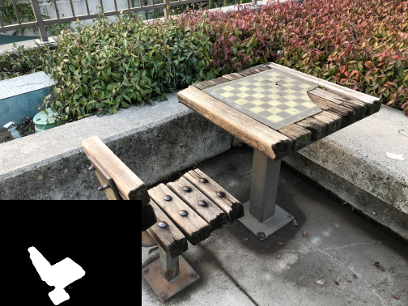

# Some Video Results of Proposed Method

## Scene 2 from SPIn-NeRF Dataset

Original Scene:  

https://github.com/Anonymousupload000/CVPR24/assets/157788658/3a8ac713-53ef-4825-b392-bd8ef013d745

Selected View and Mask:  

Inpainted Scene:  

https://github.com/Anonymousupload000/CVPR24/assets/157788658/af44966a-a53d-4fe1-ba60-f7ea65d75270

## Scene 7 from SPIn-NeRF Dataset

Original Scene:  

https://github.com/Anonymousupload000/CVPR24/assets/157788658/e35852fe-9b62-4925-8a23-02a58fa1d596

Selected View and Mask:  

Inpainted Scene:  

https://github.com/Anonymousupload000/CVPR24/assets/157788658/f9c58ac8-eb4e-4ad1-87b4-4a424e2b678b

## Scene chesstable from LLFF Dataset

Original Scene:  

https://github.com/Anonymousupload000/CVPR24/assets/157788658/00be5dad-667b-45f2-999d-e951a40f1b07

Selected View and Mask:  

Inpainted Scene:  

https://github.com/Anonymousupload000/CVPR24/assets/157788658/c1fc9214-2cfb-4a0a-a1e5-9ca0c885c914

## Scene house from LLFF Dataset

Original Scene:  

https://github.com/Anonymousupload000/CVPR24/assets/157788658/0389503d-93bd-4be7-9e94-bedd044adcd3

Selected View and Mask:  

Inpainted Scene:  

https://github.com/Anonymousupload000/CVPR24/assets/157788658/3c9f0e25-9d6e-4c97-9295-530c83732f99

## Scene mattececgo from LLFF Dataset

Original Scene:  

https://github.com/Anonymousupload000/CVPR24/assets/157788658/f4a491cf-b679-47a0-a400-32100b692061

Selected View and Mask:  

Inpainted Scene:  

https://github.com/Anonymousupload000/CVPR24/assets/157788658/1ce0d64b-45ee-4bac-b067-d2a631dfb9f8

## Scene santarex from LLFF Dataset

Original Scene:  

https://github.com/Anonymousupload000/CVPR24/assets/157788658/78505ba2-0431-49ba-b885-9a05892b3b89

Selected View and Mask:  

Inpainted Scene:  

https://github.com/Anonymousupload000/CVPR24/assets/157788658/f248cd35-8cef-44de-abb6-e4b3dee1d386

